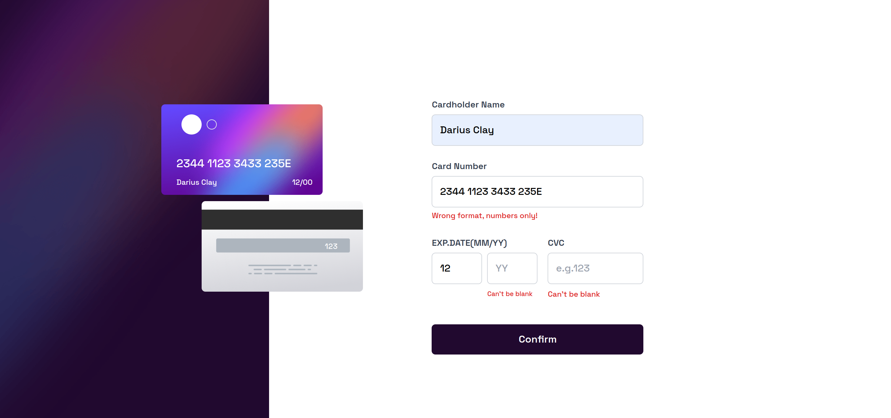

# Frontend Mentor - Interactive card details form solution

This is a solution to the [Interactive card details form challenge on Frontend Mentor](https://www.frontendmentor.io/challenges/interactive-card-details-form-XpS8cKZDWw). Frontend Mentor challenges help you improve your coding skills by building realistic projects.

## Table of contents

- [Overview](#overview)
  - [The challenge](#the-challenge)
  - [Screenshot](#screenshot)
  - [Links](#links)
  - [Built with](#built-with)
  - [What I learned](#what-i-learned)
  - [Continued development](#continued-development)
  - [Useful resources](#useful-resources)
- [Author](#author)

## Overview

### The challenge

Users should be able to:

- Fill in the form and see the card details update in real-time
- Receive error messages when the form is submitted if:
  - Any input field is empty
  - The card number, expiry date, or CVC fields are in the wrong format
- View the optimal layout depending on their device's screen size
- See hover, active, and focus states for interactive elements on the page

### Screenshot

### Links

- Solution URL: [Add solution URL here](https://your-solution-url.com)
- Live Site URL: [Add live site URL here](https://your-live-site-url.com)

### Built with

- Semantic HTML5 markup
- Tailwindcss
- Vanilla JS
- CSS custom properties
- Flexbox
- CSS Grid
- Mobile-first workflow
-

### What I learned

### **What I Learned About Form Validation**

I learned that client-side validation is essential for ensuring user inputs meet specific criteria before submission. It provides immediate feedback, improving user experience by preventing incomplete or incorrect data. By using tools like HTML attributes and JavaScript, I implemented rules such as restricting input types, checking for required fields, and validating patterns like emails or numbers. This approach makes the application more user-friendly while reducing unnecessary server requests.

### Continued development

Server-side validation ensures that form inputs are securely and reliably validated on the server after submission. This process is crucial for maintaining data integrity and protecting against security threats like tampering, SQL injection, and XSS attacks. I plan to learn how to implement server-side validation by defining validation rules, sanitizing inputs, and providing error feedback to users. This will complement client-side validation and enhance the overall security and robustness of my application.

### Useful resources

- [Tailwind resource ](https://tailwindcss.com/docs/) - This helped me with getting more familiar with tailwind.

## Author

- Website - [Add your name here](https://www.your-site.com)
- Frontend Mentor - [@yourusername](https://www.frontendmentor.io/profile/yourusername)
- Twitter - [@yourusername](https://www.twitter.com/yourusername)
